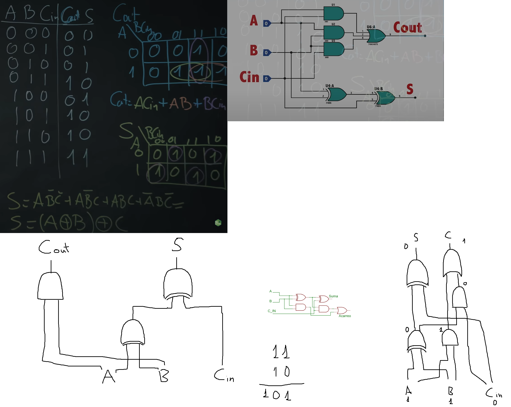
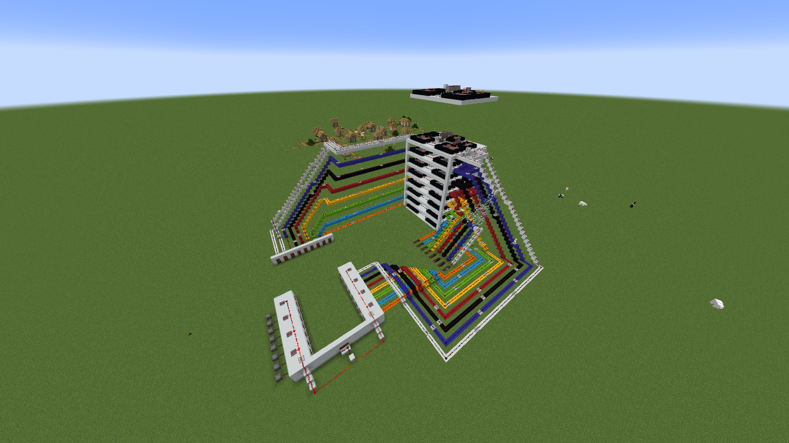
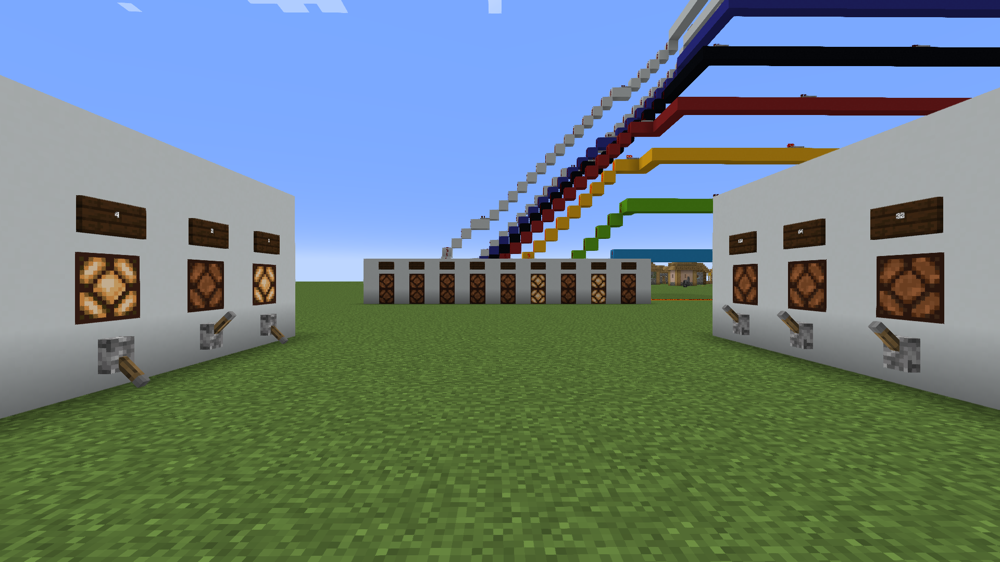
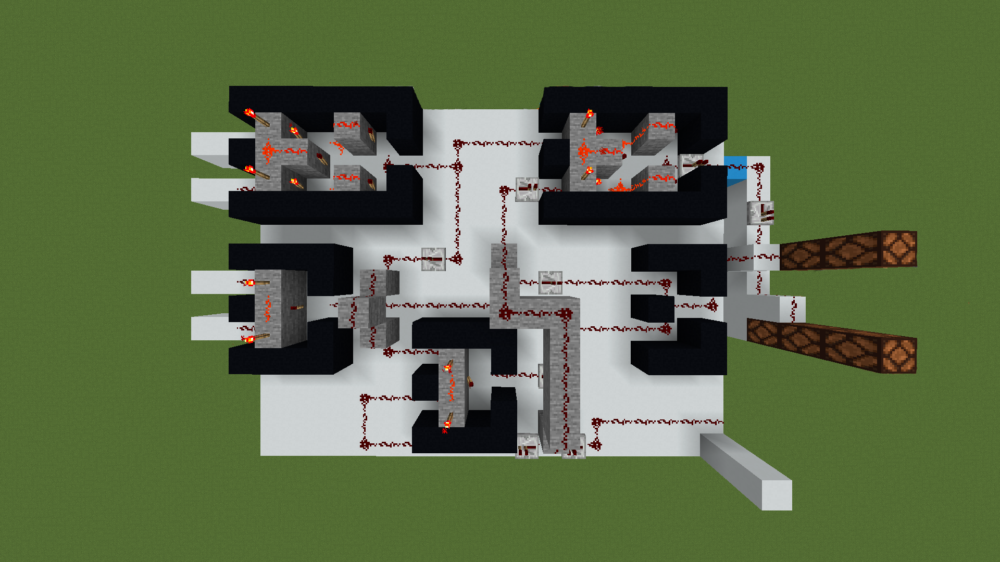

# Binary Adder in Minecraft ⚙️

A fully functional **2-byte binary adder** built from scratch in Minecraft using redstone logic gates. No mods, no commands — pure digital logic implemented in vanilla Minecraft.

---

## Demo

[](https://www.youtube.com/watch?v=LoNRlHPfwUo)

> Click the image to watch the full demo on YouTube.

---

## How it works

A binary adder is one of the fundamental building blocks of any CPU. This implementation follows the standard approach in digital electronics:

```
Half Adder:
  S    = A XOR B
  Cout = A AND B

Full Adder:
  S    = A XOR B XOR Cin
  Cout = (A AND B) OR (B AND Cin) OR (A AND Cin)
       = AB + BCin + ACin

2-byte Ripple Carry Adder:
  16 full adders chained together
  Each Cout feeds into the next bit's Cin
```

The truth table and Karnaugh maps were worked out by hand before building — the logic was then translated directly into Minecraft redstone circuits.

**Boolean expressions implemented:**
- `S = (A ⊕ B) ⊕ Cin`
- `Cout = ACin + AB + BCin`

---

## Screenshots

### Logic design — truth table, K-map and gate diagram


### Full adder overview — input panel (left), 16-bit bus routing (centre), output panel (right)


### Input/output panels — levers for binary input, note blocks for output display


### Single full adder cell — redstone XOR and AND gates, carry propagation


---

## Implementation

| Concept | Minecraft equivalent |
|---|---|
| Binary signal (0/1) | Redstone off/on |
| XOR gate | Redstone torches + repeaters |
| AND gate | Redstone torches + blocks |
| OR gate | Redstone dust merge |
| NOT gate | Redstone torch inversion |
| Input bits | Levers on input wall |
| Output bits | Lamps / note blocks on output wall |
| Signal bus | Color-coded wool + redstone lines |

The 16 full adder cells are stacked vertically and connected via a color-coded redstone bus — each color representing a different bit position, making the circuit readable and debuggable.

---

## Structure

```
world/
├── region/         # Minecraft world chunks
├── entities/       # Entity data
└── level.dat       # World metadata
assets/
├── Diagram.png
├── picture_1.png
├── picture_2.png
└── picture_3.png
```

---

## How to load it

1. Download or clone this repo
2. Copy the `world/` folder into your Minecraft saves directory:
   - Windows: `%appdata%/.minecraft/saves/`
   - macOS: `~/Library/Application Support/minecraft/saves/`
   - Linux: `~/.minecraft/saves/`
3. Open Minecraft (Java Edition) and load the world

---

## What I learned

Building this required understanding digital logic at the gate level — not just using abstractions. Translating boolean algebra into physical redstone circuits meant thinking about signal timing, propagation delay, and space constraints in 3D.

It's the same reasoning used in real CPU design, just with blocks instead of silicon.

---

## Author

**Alejandro Soria** — [@soriiaa](https://github.com/soriiaa)

[](https://www.linkedin.com/in/alejandrosoriaalcaraz/)
[](https://www.youtube.com/@sorxx_)
